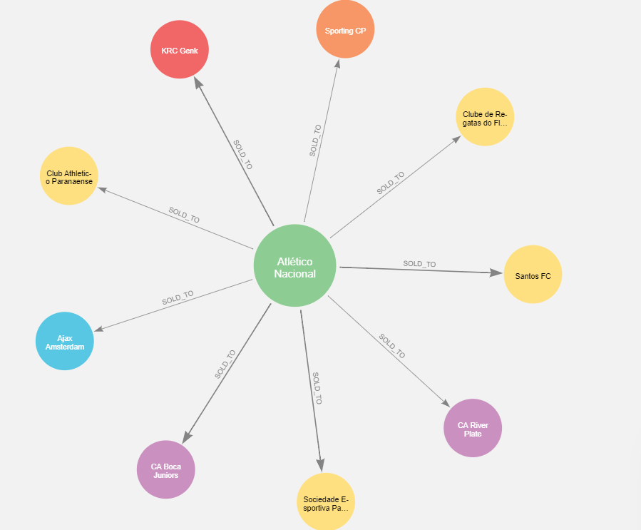

# TransferNetworkAnalysis

## 1. Project Overview
The goal of the analysis was to identify football/soccer clubs that are key actors in the network that sells players to the Top 50 teams by net transfer spend
(departures income - arrivals expenditure). Making note of such clubs is a potential way to run a more financially sustainable club model that takes on the onus of
developing talent, rather than purchasing such players at a later date from traditional "selling" clubs for a much higher price. Loading scraped data into a local
instance of neo4j and processing it through the graph tool neo4j Bloom helped facilitate a visually driven network analysis to narrow down the multitude of suppliers that have transferred players to the Top 50.

*Example network of edges stemming from a single "supplier" node:*



Also, through utilizing Cypher queries, data was extracted from the graph database and processed with pandas into tabular form to provide quantitative insights.

```python
from neo4j import GraphDatabase

def get_edges(tx):
    query = """
        MATCH (c:Club)-[r:SOLD_TO]->(c2:Club)
        RETURN c2.name AS buyingClub,
               c.name AS sellingClub,
               r.transfers AS playersSold,
               r.volume AS income
    """
    result = tx.run(query)
    records = []
    for record in result:
        record_dict = {
            'buyingClub': record['buyingClub'],
            'sellingClub': record['sellingClub'],
            'playersSold': record['playersSold'],
            'income': record['income'],
        }
        records.append(record_dict)
    return records

def get_results():
    with GraphDatabase.driver() as driver:
        with driver.session() as session:
            return session.read_transaction(get_edges)
```
## 2. Project Components
- [Web scraper](https://github.com/emarrow40/TransferNetworkAnalysis/blob/main/webScraper.py) to extract transfer data from [transfermrkt.com](https://www.transfermarkt.us/)
- [Jupyter Notebook](https://github.com/emarrow40/TransferNetworkAnalysis/blob/main/Analysis.ipynb) containing analysis notes and graph visuals generated in neo4j Bloom
